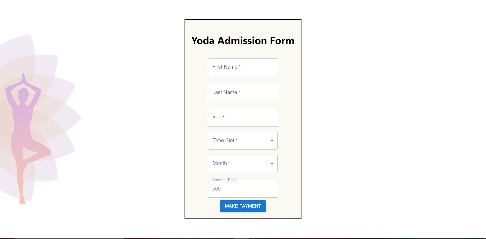
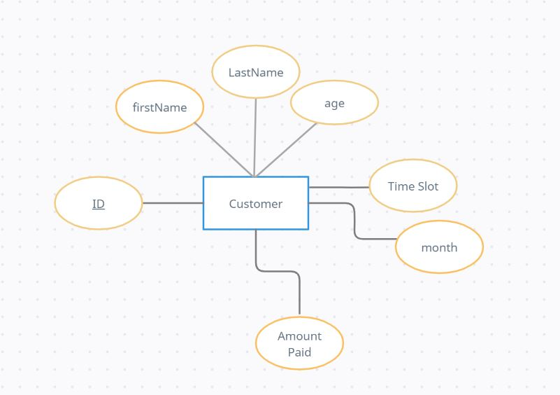

# Yoga-Admission APP

## Description
### Build a Message App with:-
- It accepts the user data and send it to the server.
- Developed one API to complete the payment
- Store the data in a Mysql Table
- Processing the response and convert it into JSON Format
- Show the response in UI
- We will get the notification of the payment status

## See Live Demo

- Hosted the mysql server on <a href="https://www.freemysqlhosting.net/">Free MySql Hosting</a>.
- Hosted the backend on <a href="https://www.cyclic.sh/">Cyclic</a>.
- Hosted the frontend on <a href="https://www.netlify.com/">Netflify</a>.

### FrontEnd --> https://yoga-admission.netlify.app/
### Backend --> https://tender-blue-caiman.cyclic.app/

## Screenshots

  
Home Page

  
  
ER Diagram

  

## Technologies Stack:

- Node.js
- Express.js
- MySql
- React.js
- Javascript
- CSS
- MUI

### How to install
- Install and setup Mysql in your machine. Follow instructions according to your machines from <a href="https://www.mysql.com/downloads/">here</a>.
- Install and setup Node.js in your machine. Follow instructions according to your machines from <a href="https://nodejs.org/en/download/">here</a>.
- Clone the project onto your Machine.
- Set up Environment variables (host, user and password) in your system to configure mysql. Refer to mysql.js file in config folder.
- Open the terminal and navigate to the folder (yoga-admission) in the termninal.
- Run the following commands
~~~
cd .\yoga-admission\
npm install
~~~
- Navigate to the client folder to Install libariers
~~~
cd .\client\
npm install
~~~
- Navigate back to Main folder
~~~
cd ../
~~~
- Now our setup is ready, we have to run the Express Server. Go back to Main folder and run
~~~
node index.js
~~~
- Our App will run on port 8000. Now we have to run the code for client side.
- Open a new terminal and go the the inside of the project and run-
~~~
cd .\client\
npm start
~~~
- Our React App will run on port 3000.
- Go the browser and go to <link>http://localhost:3000/</link>
- That's it now project is ready for use.